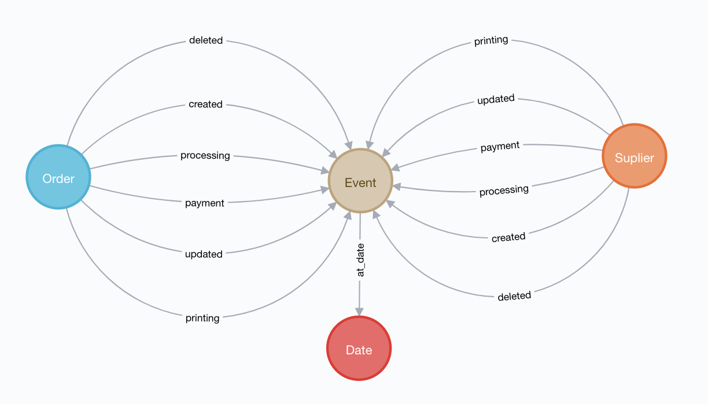

# Data Engineer Assignment

## Solution

Here a graph database is used to represent the information from tables t1, t2 and tf. A clean instance of neo4j 3.5 was used.

### Data Model

A model with 2 labels, Device and Date, is proposed as a good alternative to represent the information within csv files:

## Discussion 
### Why Graphs?
Graphs would lead to a easy way to link information. Due to native capabilities of traversing with O(1) complexity and Index Free Adjacency, it is possible to get data traversing from each label (Order, Event, Supplier, Date). 
ex:

Suppliers that accepeted an order at date X and have avg review >80 before date X.

At date X, which suppliers increased/decreased their review/accepetance_ratio from fate X-1

## Disk Saving
The original data cointains duplicated fields for timestamp and events. Here was proposed to use just the information within data columns, saving 15% of disk.

## Running the assessment

Make sure you have Golang installed: https://golang.org/doc/install

Clone the project inside $GOPATH/src/3dhubs/

`git clone https://github.com/coppetti/3dh-assignment.git`

There you can find a Makefile that has 5 methods. You should execute them in the following order:

1 - `make start`
    At 1st time, it will download a docker image from docker hub, and start a clean neo4j instance acessible at http://localhost:7474 (user: neo4j / pass:admin). This task could take a few minutes (or seconds after having the image). You can check that db is empty acessing the brouser and executing the following query:
    
    `
    MATCH (n) RETURN COUNT(n)
    ` 

    you will see that 0 nodes where found.

2 - `make imort`
    The previous steps will load the data into neo4j. Again, you can use the same query on step 1 to count the actual number of nodes.

3 - `make metrics`
    It will return the the metrics for each Supplier by date

4 - `make kill`
    Stop docker container. No data will be persisted.

## Still have issues?
Do not mind to contact: matheuscoppetti@gmail.com 